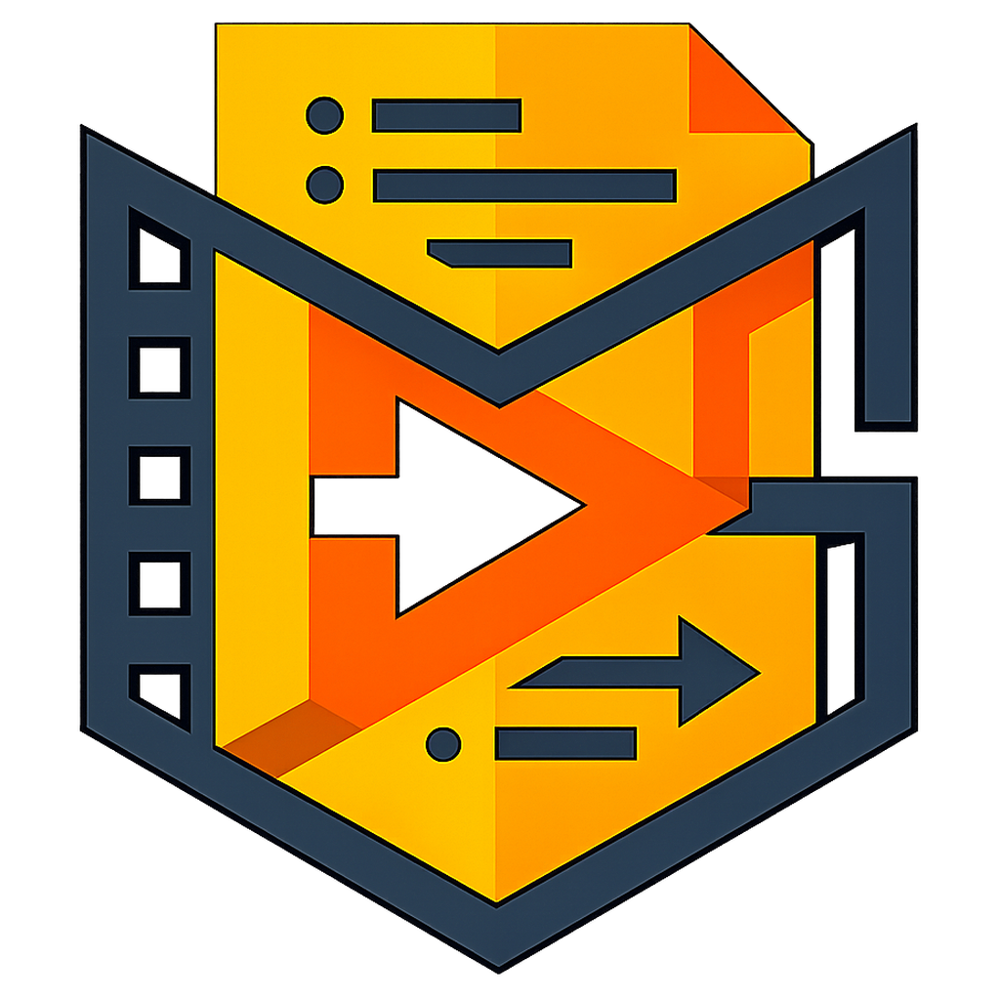
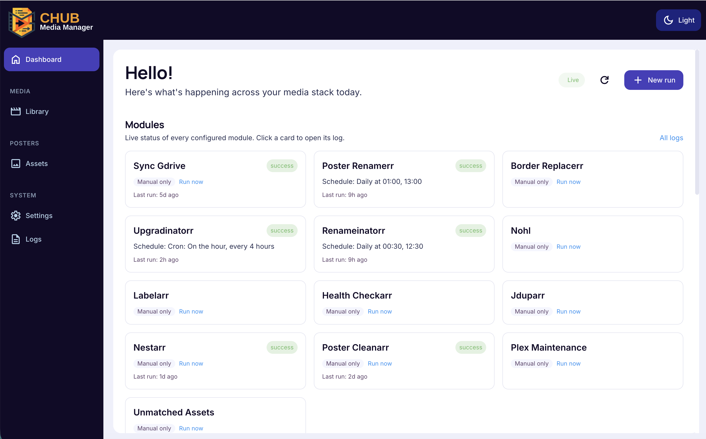
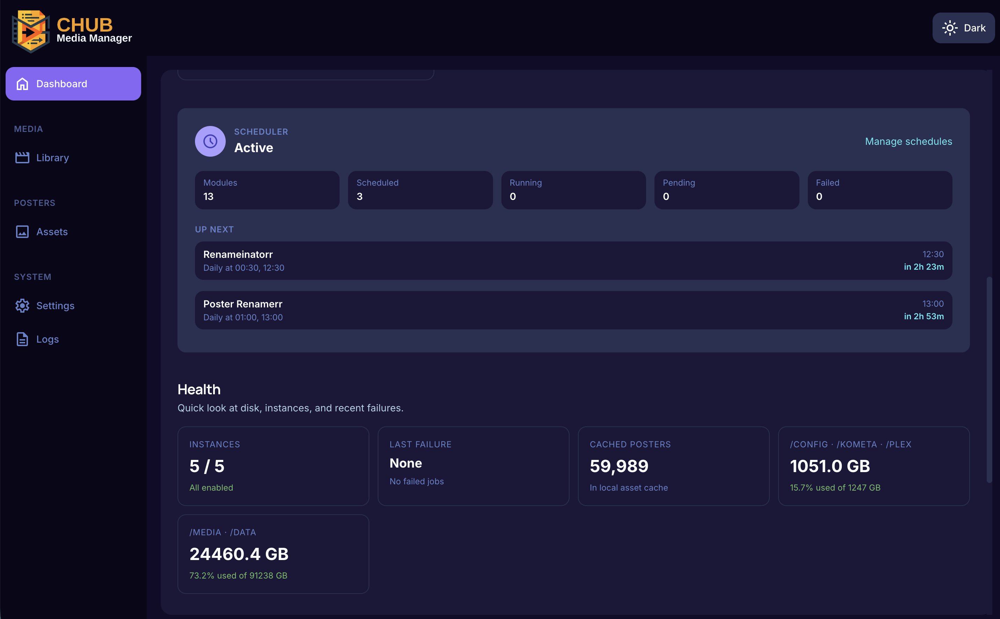

<div align="center">



# 

### Chodeus' Media Script Hub

A self-hosted, all-in-one media asset manager for your Plex/ARR stack.

[](https://opensource.org/licenses/MIT)
[](https://www.python.org/)
[](https://github.com/chodeus/chub/pkgs/container/chub)
[](https://github.com/chodeus/chub/issues)
[](https://github.com/chodeus/chub/stargazers)

</div>

---

## What is CHUB?

CHUB keeps a Plex library tidy. Point it at Radarr, Sonarr, Lidarr, and Plex, and it takes care of the boring chores on a schedule:

- **Posters** — rename them to match your library, optimize file sizes, re-apply brand or holiday borders, pull new ones from Google Drive, and clean up orphans.
- **Media** — find duplicates, flag low-rated or incomplete items, edit metadata inline with a full audit trail, and batch-import into Radarr or Sonarr.
- **Upkeep** — upgrade searches, rename sweeps, health checks, hardlink audits, ARR tag → Plex label sync.

You run it in Docker, open it in a browser, configure it once, and let it work.

---

## Screenshots

| Light | Dark |
| :---: | :---: |
|  |  |

---

## Quickstart

### Docker Compose (recommended)

Save this as `compose.yaml` and adjust the paths to your setup:

```yaml
services:
  chub:
    image: ghcr.io/chodeus/chub:latest
    container_name: chub
    restart: unless-stopped
    ports:
      - "8000:8000"
    environment:
      PUID: "1000"             # Unraid users: 99
      PGID: "1000"             # Unraid users: 100
      TZ: "America/Los_Angeles"
    volumes:
      - /srv/apps/chub/config:/config
      - /srv/apps/chub/posters:/posters
      - /srv/media:/media
      - /srv/kometa/assets:/kometa
```

Then:

```bash
docker compose up -d
```

Open <http://localhost:8000>, create your admin user, connect your Radarr / Sonarr / Plex under **Settings → Instances**, and enable the modules you want under **Settings → Modules**.

Full walk-through: **[Wiki → Installation](https://github.com/chodeus/chub/wiki/Installation)**.

### Other install methods

Single-command Docker, Unraid, and bare-metal options: **[Wiki → Installation](https://github.com/chodeus/chub/wiki/Installation)**.

---

## Security — read before exposing CHUB

**CHUB is built for a private network.** Run it on a LAN or behind a VPN. Before putting it anywhere else, take the steps below.

1. **Use a strong admin password.** First-run enforces 8+ characters; use more. Lose it and you reset with `docker compose run --rm chub python3 main.py --reset-auth`.
2. **If you want remote access, put CHUB behind a reverse proxy with TLS.** Add a second auth layer in front (Authelia, Authentik, Cloudflare Access). CHUB has built-in login and rate limiting, but no WAF or DDoS protection — it isn't meant to face the open internet alone.
3. **Set a webhook secret if webhooks leave your LAN.** Configure `general.webhook_secret` in **Settings → General**. Any inbound Sonarr/Radarr/Tautulli webhook must then include it. Without it, webhook URLs are unauthenticated — fine inside a LAN, not fine on the public internet.
4. **Pin the image tag for production.** Use a specific digest or date tag instead of `:latest` if you care about reproducible deploys.
5. **Report vulnerabilities privately.** See [SECURITY.md](SECURITY.md) for the disclosure process.

---

## Documentation

The GitHub Wiki is the full source:

- **[User Guide](https://github.com/chodeus/chub/wiki)** — installation, configuration, per-module walk-through, UI tour, webhooks, troubleshooting, FAQ.
- **[Developer Guide](https://github.com/chodeus/chub/wiki/Developer-Guide)** — REST API reference, extending CHUB with new modules, security internals.

---

## Credits

CHUB is a fork of [DAPS](https://github.com/Drazzilb08/daps) by **Drazzilb08** — thank you for the scripts and inspiration that made this possible.

Licensed under the [MIT License](LICENSE).
