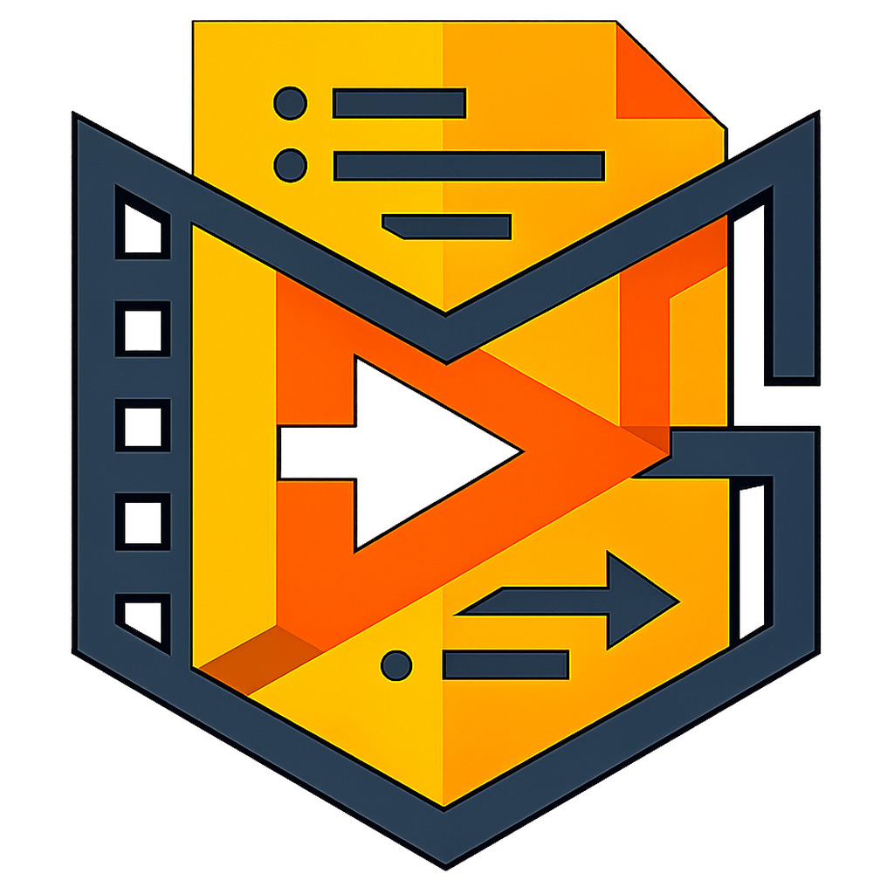
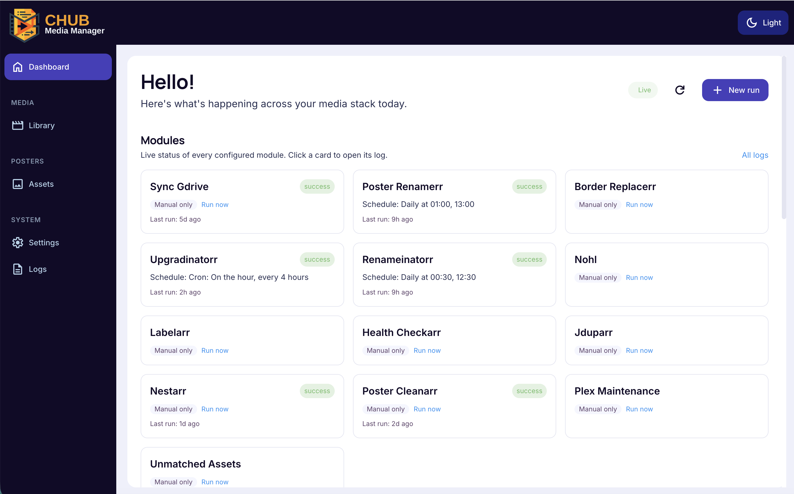
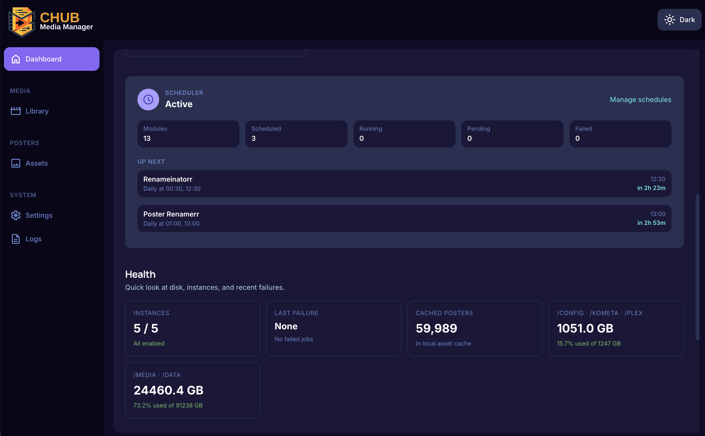

<div align="center">



# 

### Chodeus' Media Script Hub

A self-hosted, all-in-one media asset manager for your Plex/ARR stack.

[](https://opensource.org/licenses/MIT)
[](https://www.python.org/)
[](https://github.com/chodeus/chub/pkgs/container/chub)
[](https://github.com/chodeus/chub/issues)
[](https://github.com/chodeus/chub/stargazers)

</div>

---

## What is CHUB?

CHUB keeps a Plex library tidy. Point it at Radarr, Sonarr, Lidarr, and Plex, and it takes care of the boring chores on a schedule:

- **Posters** — rename them to match your library, optimize file sizes, re-apply brand or holiday borders, pull new ones from Google Drive, and clean up orphans.
- **Media** — find duplicates, flag low-rated or incomplete items, edit metadata inline with a full audit trail, and batch-import into Radarr or Sonarr.
- **Upkeep** — upgrade searches, rename sweeps, health checks, hardlink audits, ARR tag → Plex label sync.

Run it in Docker, open it in a browser, and configure it once.

---

## Screenshots

| Light | Dark |
| :---: | :---: |
|  |  |

---

## Quickstart

### Docker Compose (recommended)

Save this as `compose.yaml` and adjust the paths to your setup:

```yaml
services:
  chub:
    image: ghcr.io/chodeus/chub:latest
    container_name: chub
    restart: unless-stopped
    ports:
      - "8000:8000"
    environment:
      PUID: "1000"             # Unraid users: 99
      PGID: "1000"             # Unraid users: 100
      TZ: "America/Los_Angeles"
    volumes:
      - /srv/apps/chub/config:/config
      - /srv/apps/chub/posters:/posters
      - /srv/media:/media
      - /srv/kometa/assets:/kometa
```

Then:

```bash
docker compose up -d
```

Open <http://localhost:8000>, create your admin user, connect your Radarr / Sonarr / Plex under **Settings → Instances**, and enable the modules you want under **Settings → Modules**.

> **Rootless alternative.** Replace `PUID`/`PGID` with `user: "99:100"` (the uid:gid that owns your appdata) and pre-`chown` the host config dir to match.

Migrating from an older YAML-based version? Drop your `config.yml` into the config dir before first launch — CHUB backs it up and migrates it automatically. Details: **[Wiki → Configuration → Auto-migration](https://github.com/chodeus/chub/wiki/Configuration#-auto-migration-from-older-config-formats)**.

Full walk-through: **[Wiki → Installation](https://github.com/chodeus/chub/wiki/Installation)**.

### Image tags

| Tag | What you get |
| --- | --- |
| `latest` | Core CHUB, kept deliberately minimal (~210 MB compressed). |
| `full` | Everything in `latest` plus the extension toolchain: the **CL2K poster maker** (ImageMagick + librsvg rendering, real Arial, layered PSD export) and the **poster self-heal** module (~345 MB). |
| `vX.Y.Z` / `vX.Y.Z-full` | The same two images pinned to a release. |
| `develop` | Deprecated alias of `full` — switch to `full`; this alias will stop updating. |

Switching between tags is safe in both directions: the tools live in the image, not your volume. A config written under `full` keeps its extension sections on `latest` (typed, preserved across saves), database tables and generated posters are never touched, and moving back to `full` finds everything as you left it. Leaving `full` for good and want a spotless config? Delete the `cl2k_maker:` and `poster_self_heal:` blocks from `config.yml` — that's all there is.

### Other install methods

Single-command Docker, Unraid, and bare-metal options: **[Wiki → Installation](https://github.com/chodeus/chub/wiki/Installation)**.

---

## Documentation

The GitHub Wiki is the full source:

- **[User Guide](https://github.com/chodeus/chub/wiki)** — installation, configuration, per-module walk-through, UI tour, webhooks, troubleshooting, FAQ.
- **[Developer Guide](https://github.com/chodeus/chub/wiki/Developer-Guide)** — REST API reference, extending CHUB with new modules, security internals.

---

## Improvements over DAPS

CHUB re-implements the DAPS modules on a database-backed, web-driven architecture and refines their behaviour along the way:

- **More reliable runs** — health_checkarr prunes cleanly in live mode, nohl triggers searches under per-instance configs, and search-driven modules retry next run instead of marking an item done when its search didn't actually complete.
- **Safer poster cleanup** — poster_cleanarr matches on stable TMDB/TVDB ids before folder names, keeps the last remaining copy of a poster, and pauses instead of purging when an *arr instance is unreachable.
- **Better upgrade coverage** — upgradinatorr only tags an item once every search (all seasons, for series) succeeds, and skips a zero/blank count rather than clearing the whole library's checked tags.
- **Respects your filters** — renameinatorr re-applies your ignore filter after each cycle so items tagged to be left alone stay untouched, and honours per-run count limits.
- **Correct labels** — labelarr matches *arr tags by name (so a tag with internal id 0 still syncs) and removes managed Plex labels once their *arr entry is gone.
- **Sharper matching** — id-aware fallback plus broader title normalization (`&` ⇄ `and`, region tags, `{tvdbid-…}` blocks, season forms) so near-miss titles line up.
- **Robust rendering & integrations** — border_replacerr expands short hex colours the standard way, genuinely skips unchanged posters, and survives leap-day holiday schedules; sync_gdrive and jduparr harden their rclone/jdupes handling and report real failures instead of silent success.**.

---

## A note on AI-assisted development

I write large portions of CHUB's source, tests, and documentation with the help of an AI coding assistant (Anthropic's Claude). I review every change before it lands, but you should know what you're running: if a behavior, doc, or config option looks wrong, trust what the code actually does and [open an issue](https://github.com/chodeus/chub/issues).

---

## Credits

CHUB is a fork of [DAPS](https://github.com/Drazzilb08/daps) by **Drazzilb08** — thank you for the scripts and inspiration that made this possible.

Logo and background artwork is sourced from [fanart.tv](https://fanart.tv) — images and metadata are provided by fanart.tv and its contributors.

Licensed under the [MIT License](LICENSE).
