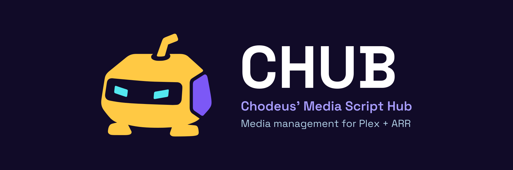
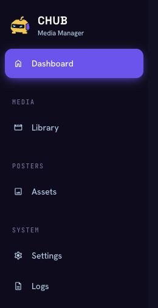

# CHUB brand assets

The media bot uses CHUB's gold, indigo, violet, and cyan palette. The sharp-eyed
version is the application logo; the wink is an alternate expression.



## Artwork

| Asset | Vector | PNG |
| --- | --- | --- |
| Main mascot, transparent | [SVG](../chub-logo.svg) | [1024 px](../chub-logo.png) |
| Winking mascot, transparent | [SVG](chub-mascot-wink.svg) | [1024 px](chub-mascot-wink.png) |
| White mascot, transparent | [SVG](chub-mascot-white.svg) | [1024 px](chub-mascot-white.png) |
| Indigo mascot, transparent | [SVG](chub-mascot-indigo.svg) | [1024 px](chub-mascot-indigo.png) |
| Dark GitHub header | [SVG](chub-github-header.svg) | [1800 × 600](chub-github-header.png) |
| Light GitHub header | [SVG](chub-github-header-light.svg) | [1800 × 600](chub-github-header-light.png) |
| GitHub social preview | [SVG](chub-social-preview.svg) | [1280 × 640](chub-social-preview.png) |
| Alternate GitHub banner | — | [2172 × 724](chub-github-banner.png) |
| Small favicon | [SVG](chub-favicon.svg) | [16 px](../../frontend/public/img/favicon-16x16.png), [32 px](../../frontend/public/img/favicon-32x32.png) |

The SVGs contain editable paths, with no embedded raster images, scripts,
external resources, or font dependencies. Header lettering is outlined from
[Space Grotesk](https://github.com/floriankarsten/space-grotesk), licensed under
the SIL Open Font License.

Use the full-color mascot on light or dark backgrounds. The white and indigo
versions provide single-color alternatives. Keep the mascot's aspect ratio and
leave clear space around its antenna and feet.

### Sidebar preview

The production frontend with sample API responses, showing the 34 px SVG mark:



## Application icons

The app uses `frontend/public/img/chub-logo.svg`. Its PNG counterpart is available
for consumers that require a raster image.

- `favicon.svg` and the 16/32 px PNGs use a simplified silhouette and visor.
- The 48/64 px PNGs retain the full mascot.
- `favicon.ico` contains all four sizes, using the same artwork as each PNG.
- `apple-touch-icon.png` is an opaque 180 px indigo tile with the mascot inset.

## Re-exporting

Install Python 3.10+, [Pillow](https://pillow.readthedocs.io/), and
[librsvg](https://gitlab.gnome.org/GNOME/librsvg) (`rsvg-convert`), then run these
commands from the repository root:

```sh
python -m pip install Pillow
python scripts/export_brand_assets.py
```

Run the script after editing the SVG sources. It refreshes the application copies,
mascot PNGs, light/dark headers, social preview, favicons, and touch icon. The alternate banner is
standalone raster artwork and is left unchanged by this command. Browser and
application builds do not require these export tools.
